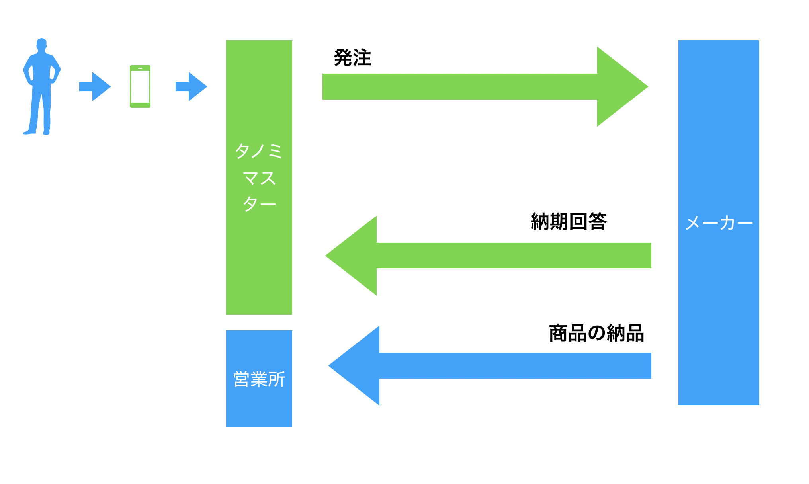
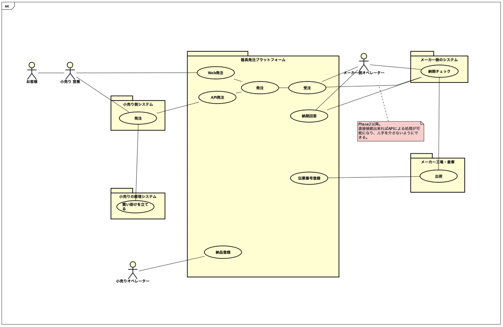
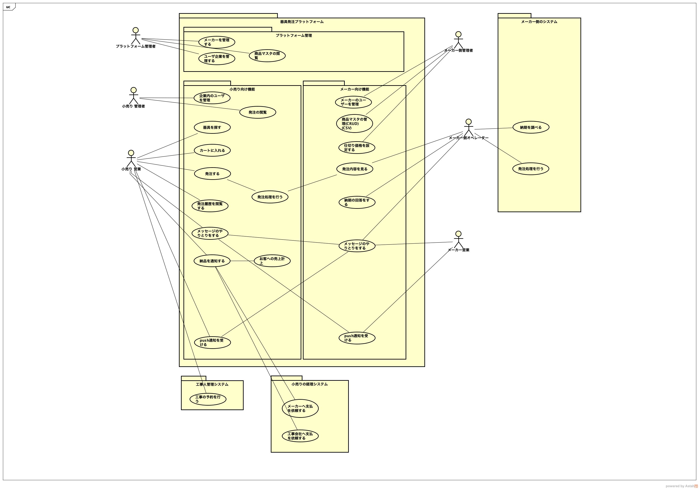
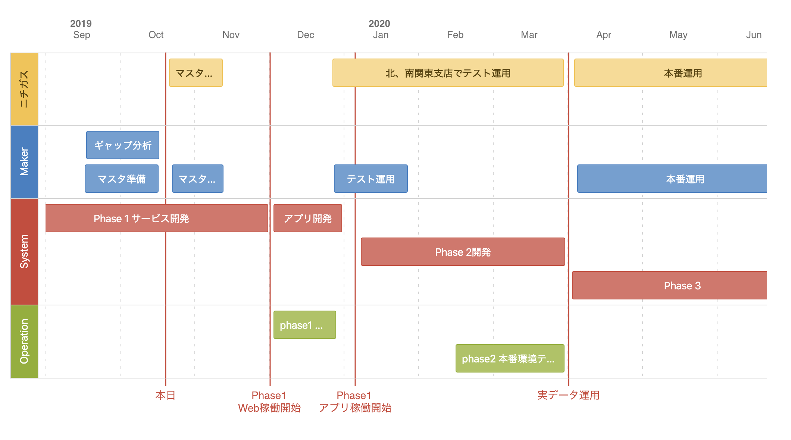

## システム概要

- タノミマスターとはB2Bの受発注をやり取りするプラットフォームです。
- タノミマスターのシステムははグローバルで1つ存在し、複数の小売店と複数のメーカーが利用します。
- 概念図（略図）を以下に記載します。

[拡大](assets/model.png)

以下に主要業務のユースケース図を記載します。

[拡大](assets/usecase_abstract.png)

以下にアクターの役割別、機能の粒度で記載したユースケース図を記載します。

[拡大](assets/usecase_detail.png)

## 利用開始手順

タノミマスターはインターネットサービスです。各小売、各メーカーごとにログインページにアクセスするためにはサーバ側でIPアドレスの登録が必要になります。

小売、メーカーともに以下の手順で利用を開始できます。

1. `接続元IPアドレス`と`管理者のメールアドレス`をタノミマスター管理者へ申請
1. タノミマスター管理者からログインページのURLとパスワードを受領
1. ログインして、各種マスタを登録

## 共通概念

小売とメーカーはそれぞれ以下の組織構造によって階層化されています。

- 会社
  - 支店
    - 営業所
      - 営業員

## フェーズ定義

タノミマスターの開発は以下のフェーズで行われます。

- フェーズ1開発
  - 2019/12まで
    - 基本機能の開発
    - Webからの受発注、納期回答を行える
    - iOS/Androidアプリの開発
- フェーズ2開発
  - 2020/4まで
    - ニチガス基幹システムとの連携
    - 可能なら、メーカー側のBMS対応
    - メーカーへの支払い用ファイル出力
    - 注文の担当者変更
    - ニチガス本番運用
- フェーズ3開発
  - 小売向け決済機能
  - 関連商品の入稿

[拡大](assets/schedule.png)

