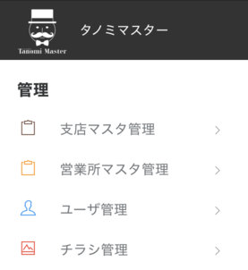
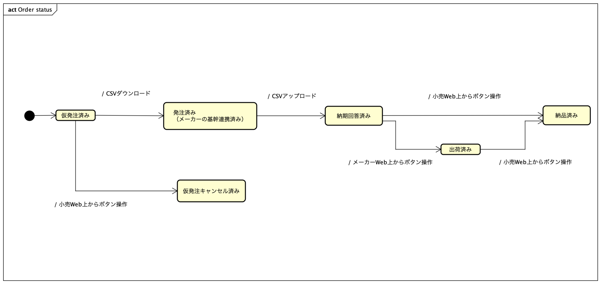

## 概要

- 主に、発注と発注ステータス管理を行えます。
- この説明書は、サービスの利用にあたって、必要となるモデルや概念について解説します。

## ロール

3種類のロール（役割）があります。

- 管理者
  - マスタの管理を行います。
- 事務員
  - 納品を確認し、発注ステータスに反映します。
- 営業
  - 自分の担当する注文でメーカーの担当者とチャットを行えます。

## 端末

各小売ごとに異なるログイン用URLが割り当てられます。各ログインページは、初期に登録した接続元のIPアドレスを登録しなければ表示することができません。

- Web
- アプリ
  - 重要な通知はPush通知が配信されます。

## 初期設定

- 管理者でログインして、マスタを入稿します。

### マスタ入稿

- マスタデータはすべてWebから入稿できます。依存関係があるので基本的に上の方からデータを入稿するのがおすすめです。入稿フォーマットの詳細は[入稿データフォーマット](csv.md)を参照してください。
- チラシは各支店ごとに入稿できます。

## 運用

### チャット

- 発注者とメーカー担当者は1:1のチャットを行えます。表示はリアルタイムに行われます。
- 注文が行われた際に、マスタで入稿されたルールに従って小売の営業所に対応するメーカーの担当が自動的にアサインされます。

### 納期回答

- 小売から行われた注文における、ステータスは以下のように管理されます。
- メーカー側において、CSVダウンロードが行われる前は小売からの注文のキャンセルが可能です。

